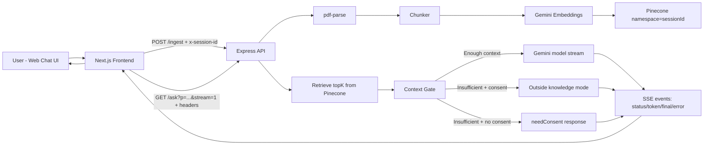
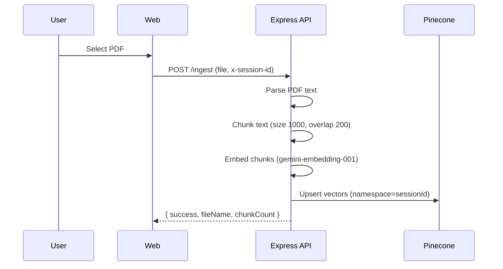
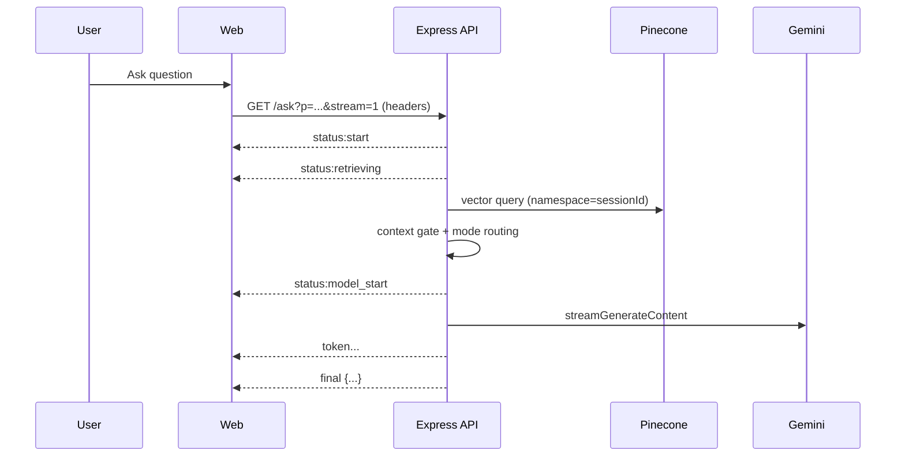

# RAG Application (Monorepo)

Production-style, session-scoped PDF RAG app with a Next.js frontend and Express API.

- Upload a PDF
- Chunk + embed + store vectors in Pinecone
- Ask questions against that PDF
- Receive streamed responses over SSE
- Fall back across multiple Gemini models with retry/timeout handling

---

## Table of Contents

- [Project Overview](#project-overview)
- [Tech Stack](#tech-stack)
- [Architecture](#architecture)
- [Core Workflows](#core-workflows)
- [Reliability and Fallback Strategy](#reliability-and-fallback-strategy)
- [Session and Privacy Model](#session-and-privacy-model)
- [Repository Structure](#repository-structure)
- [Environment Variables](#environment-variables)
- [Getting Started (Local)](#getting-started-local)
- [API Contract](#api-contract)
- [Frontend Behavior](#frontend-behavior)
- [Troubleshooting](#troubleshooting)
- [Roadmap / Next Improvements](#roadmap--next-improvements)

---

## Project Overview

This repository contains a monorepo with:

- `api/`: Express + TypeScript backend for ingestion, retrieval, and answer generation
- `web/`: Next.js + React frontend for upload + chat UI

The app is designed around **session isolation** using `x-session-id`:

- Each upload/query is associated with a single session ID
- Retrieval is constrained to the session namespace in Pinecone
- Outside-knowledge usage is controlled by per-session consent in the UI

---

## Tech Stack

### Frontend (`web/`)

- Next.js `16.2.4`
- React `19.2.4`
- Tailwind CSS v4
- `react-markdown` + `remark-gfm` for assistant Markdown rendering

### Backend (`api/`)

- Node.js + Express 5 + TypeScript
- `multer` for file upload (`multipart/form-data`)
- `pdf-parse` for PDF text extraction
- LangChain Google integrations + Gemini models
- Pinecone for vector storage/retrieval

### AI/RAG

- Embeddings: `gemini-embedding-001`
- Vector DB: Pinecone index + session namespace
- Answer path:
  - Context-gated RAG for PDF-grounded answers
  - Optional outside-knowledge answering (with user consent)
  - Streaming answer tokens via SSE

---

## Architecture



---

## Core Workflows

## 1) PDF Ingestion Workflow



## 2) Ask / Streaming Workflow



---

## Reliability and Fallback Strategy

Current model ladder (configured in `api/query.ts`):

1. `gemini-3.1-flash-lite-preview`
2. `gemini-3-flash-preview`
3. `gemini-2.0-flash`
4. `gemini-2.0-flash-lite`

Engineering behaviors in place:

- Retryable failure detection (429/5xx/network timeout classes)
- Rate-limit aware model switching
- Per-attempt timeout for stream startup
- SSE status events exposed to frontend so users see progress
- Non-stream fallback path as last resort

---

## Session and Privacy Model

- Session identity is provided by `x-session-id` on all ingestion/query calls.
- Pinecone operations are scoped to `namespace(sessionId)`.
- Outside-knowledge consent is stored client-side per session:
  - localStorage key pattern: `outside:<sessionId>`
- Default behavior is PDF-grounded response path unless outside mode is allowed.

---

## Repository Structure

```text
rag-application/
  api/
    index.ts
    embed.ts
    query.ts
    llm.ts
  web/
    src/
      app/
      components/
  README.md
  CODEBASE_OVERVIEW.md
  PROJECT_SPEC.md
  .env.example
```

---

## Environment Variables

Create your env file from `.env.example` (see below).

Required:

- `GOOGLE_API_KEY`: Google Generative AI API key
- `PINECONE_API_KEY`: Pinecone API key
- `PINECONE_INDEX`: Pinecone index name

The API loads env via `dotenv/config`. Keep secrets out of git.

---

## Getting Started (Local)

## 1) Clone and install

```bash
git clone https://github.com/Mustafiz82/Rag-Application
cd rag-application
npm install
```

## 2) Configure env

```bash
cp .env.example api/.env
```

Then update `api/.env` with real values.

## 3) Run dev

```bash
npm run dev
```

This starts:

- API (deployed): `https://rag-application-3w9w.onrender.com/`
- Web: `http://localhost:3000`

## 4) Build

```bash
npm run build
```

---

## API Contract

## `GET /`

Health check.

## `POST /ingest`

Upload + embed PDF for a session.

Headers:

- `x-session-id: <uuid-or-session-key>`

Body:

- `multipart/form-data`
- field name: `file` (PDF)

Response:

```json
{ "success": true, "fileName": "example.pdf", "chunkCount": 26 }
```

## `GET /ask`

Query the session PDF context.

Query params:

- `p`: question text
- `stream=1` (optional) to enable SSE streaming

Headers:

- `x-session-id`
- `x-allow-outside-knowledge` (`1` or `0`)
- `Accept: text/event-stream` (for SSE mode)

SSE events:

- `status`
- `token`
- `final`
- `error`

---

## Frontend Behavior

- Upload screen sends `/ingest` with session header
- Chat sends `/ask?...&stream=1` and consumes SSE
- UI renders:
  - live status labels (retrieving/model/fallback)
  - token-by-token streaming answer
  - Markdown output with code formatting
- If API returns `needConsent`, UI prompts for outside-knowledge permission and remembers per session

---

## Troubleshooting

## Long delay before answer

- Likely provider-side throttling/rate-limits or delayed stream startup.
- Check frontend console status progression (`retrieving`, `model_start`, `model_error`, etc.).
- Verify API env keys and Pinecone index are valid.

## No answer from PDF

- Ensure upload succeeded and `chunkCount > 0`
- Ensure same `x-session-id` is used for upload and query
- Confirm PDF contains extractable text (not image-only scan without OCR)

## `Missing GOOGLE_API_KEY` or Pinecone errors

- Verify `api/.env` values
- Restart API after env changes

---

## Roadmap / Next Improvements

- Add formal citation rendering with source chunk/page references in UI
- Add OCR path for image-only PDFs
- Add persistent session store and server-side preference memory
- Add test suite for retrieval and model fallback behavior
- Remove debug-only instrumentation paths after full verification cycle

